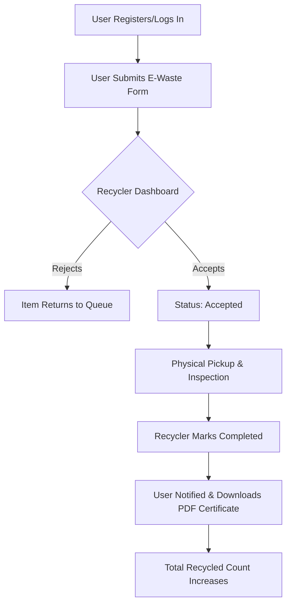

# ♻️ Ecometa: The Intelligent E-Waste Circular Economy

**Ecometa** is a state-of-the-art waste management platform designed to bridge the gap between individual e-waste generators and certified recycling centers. By providing a transparent, traceable, and rewarding ecosystem, Ecometa ensures that hazardous electronic waste is disposed of responsibly, promoting a cleaner and greener environment.

---

## 🚀 The Vision
Every year, millions of tons of e-waste end up in landfills, leaking toxic chemicals into the soil. **Ecometa** digitizes the recycling process, allowing users to schedule pickups, track their environmental impact, and receive official recycling certificates.

---

## 🛠️ Technology Stack

| Layer | Technology | Details |
| :--- | :--- | :--- |
| **Frontend** | React.js | Vibrant, responsive UI with modern state management. |
| **Backend** | Spring Boot 3.2.4 | Robust REST API built on the enterprise-grade Java framework. |
| **Database** | MongoDB Atlas | Cloud-native NoSQL database for high scalability and flexibility. |
| **Security** | Spring Security | BCrypt password hashing and role-based access control (RBAC). |
| **Reporting** | iText PDF | Automated generation of Recycling Certificates. |
| **Email** | Gmail SMTP | Real-time notifications for status updates. |

---

## 👥 User Personas & Workflows

### 1. 🏠 The Individual (User)
**Who is it?** Households or small businesses with old gadgets (phones, laptops, batteries).

**The Workflow:**
1.  **Onboarding**: Secure registration and login using encrypted credentials.
2.  **Submission**: Upload e-waste details (type, quantity, condition, and location).
3.  **Live Updates**: Track the status of the item (Submitted → Accepted → Collected).
4.  **Reward**: Once collected, the user's "Recycled Count" increases.
5.  **Certification**: Download an official **Recycling Certificate** to prove environmental contribution.

### 2. 🚛 The Certified Recycler
**Who is it?** Verified recycling facilities looking to source raw materials for processing.

**The Workflow:**
1.  **Verification**: Login to a dedicated Recycler Dashboard.
2.  **Discovery**: View all pending e-waste submissions in their region.
3.  **Action**: Inspect details and choose to **Accept** or **Reject** a pickup request.
4.  **Collection**: Mark items as **Collected** once the physical pickup is completed.
5.  **Dashboard Analytics**: Track total units collected and impact metrics.

### 3. 🛡️ The System Administrator
**The Workflow:**
1.  **Monitoring**: Access global reports on recycling activity across the platform.
2.  **Audit**: Ensure items are being processed fairly and recyclers are active.

---

## 📊 App Flow (Lifecycle)



---

## ⚙️ Installation & Local Setup

### Prerequisites
*   Node.js (v18+)
*   Java JDK 17
*   Maven
*   MongoDB Atlas Account

### Backend Configuration
Update `backend/src/main/resources/application.properties`:
```properties
spring.data.mongodb.uri=YOUR_MONGODB_ATLAS_URI
spring.mail.username=your-email@gmail.com
spring.mail.password=your-app-password
```

### Running Locally
1.  **Start Backend**:
    ```bash
    cd backend
    mvn spring-boot:run
    ```
2.  **Start Frontend**:
    ```bash
    cd fronend
    npm install
    npm start
    ```

---

## 🛡️ Security & Privacy
*   **Password Protection**: All user passwords are encrypted using **BCrypt** before they ever hit the database.
*   **Role Protection**: Only users logged in as "RECYCLER" can see the Recycler Dashboard. Users cannot see each other's private submissions.

---

## 🌍 Impact
By using Ecometa, you are directly contributing to the **Circular Economy**. Every certificate issued represents hazardous minerals (Lithium, Lead, Mercury) that have been successfully diverted from nature and put back into the manufacturing cycle.

---

> [!TIP]
> **Pro Tip**: Use the dashboard to see your total "units saved." Every gadget counts towards a healthier planet!

Developed with ❤️ by **The Ecometa Team**.
